# 2021.5.21 周报

## 本周完成工作

1.导师指导修改论文细节问题，制作答辩PPT

2.学习了Git相关的知识

3.docker练习搭载服务器

## 本周工作总结

1.学习git相关知识后，明白了师兄师姐组会的大部分操作。

2.docker的搭载一定要开相应端口。

## 下周工作计划

1.git相关的知识应该就可以学完了

2.继续学习docker

3.找老师检查答辩PPT


# 关于Git

Git、Github、Gitlab、Gitee

在旁听组会的时候会看到师兄师姐提交项目gitlab，有的文件寻找又在github，但是我论文查找代码的时候又在gitee上，师兄给的入门导学又让学习git文档，那这几种有什么区别呢？

本文后续还需要学习一些vscode的操作，重新配置一下git；

GitHub的ssh设置和push操作需要再来一遍。

本文学习的出处：https://www.bilibili.com/video/BV1fK4y1b7XL?p=12；https://blog.csdn.net/jiahuan_/article/details/105933423；https://www.bilibili.com/video/BV1FE411P7B3?p=12&spm_id_from=pageDriver；https://git-scm.com/book/zh/v2

## 版本控制

> 什么是版本控制 版本迭代，新的版本！版本管理器

版本控制是一种在开发的过程中用于管理我们对文件、目录或工程等内容的修改历史，方便查看更改实力记录，备份以便恢复以前的软件工程技术。

- 实现跨区域多人协同开发(git、svn、好一些的用gitlab搭建自己的工程)
- 追踪和记载一个或者多个文件的历史纪录
- 组织和保护你的源代码和文档
- 统计工作量
- 并行开发、提高开发效率
- 跟踪记录整个软件的开发过程
- 减轻开发人员的负担，节省时间，同时降低人为错误

简单说就是用于管理多人协同开发项目的技术

没有进行版本控制或者版本控制本身缺乏正确的流程管理，在软件开发过程中将会引入很多问题。

无论是工作还是学习，或者自己做笔记，都经历过不断修改方案的过程！这就需要一个版本控制工具，方便查看原来的版本！

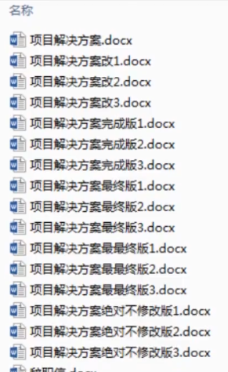

多人开发就必须使用版本控制。

> 常见的版本控制工具

学习的东西一定是当下主流的。

当前主流的版本控制器由如下一些(普及常识)：

- Git
- SVN (subversion)
- CVS (concurrent versions system)
- VSS (micorosoft visual sourcesafe)
- TFS (team foundation server)
- visual studio online

> 版本控制分类

**1.本地版本控制**

记录文件每次更新，可以对每个版本做一个快照，或是记录补丁文件，适合个人用，如RCS。

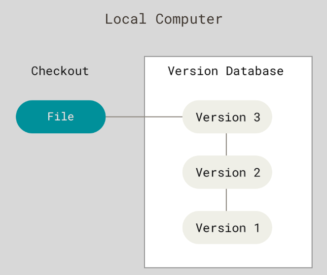

**2.集中版本控制**

所有的版本数据都保存在服务器上，协同开发者从服务器上同步更新或上传自己的修改

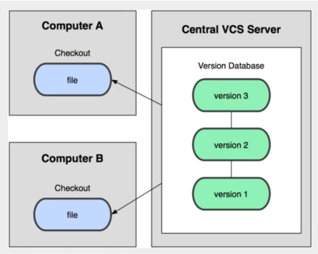

所有的版本数据都存在服务器上，用户本地只有自己以前所同步的版本，如果不联网的话，用户就看不到历史版本，也无法切换版本验证问题，或在不同分支工作。而且所有数据都保存在单一的服务器上，有很大的风险这个服务器会损坏，这样就会丢失所有的数据，当然可以定期备份。代表产品：SVN、CVS、VSS

**3.分布式版本控制 Git** 

每个人都拥有全部的代码！

所有版本信息仓库全部同步到本地的每个用户，这样就可以在本地查看所有版本历史，可以离线在本地提交，只需在连网是push到相应的服务器或其他用户那里。由于每个用户那里保存的都是所有的版本数据，只要有一个用户的设备没有问题就可以恢复所有的数据，但这增加了本地存储空间的占用。

不会因为服务器损坏或者网络问题，造成不能工作的情况！

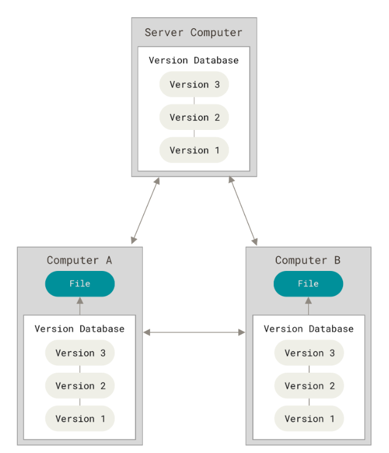

> Git与SVN最主要区别(常识)

SVN是集中式版本控制系统，版本库是集中放在中央服务器的，而工作的时候，用的都是自己的电脑，所以首先要从中央服务器得到最新的版本，然后工作，完成工作后，需要把自己做完的活推送到中央服务器。集中式版本控制系统是必须联网才能工作，对网络带宽要求较高。


Git是分布式版本控制系统，没有中央服务器，每个人的电脑就是一个完整的版本库，工作的时候不需要联网，因为版本都在自己电脑上。协同的方法式这样的:比如自己在电脑上改了文件A，其他人也在电脑上改了文件A，这时，我们两之间只需把各自的修改推送给对方，就可以想哭看到对方的修改了。

==**Git是目前世界上最先进的分布式版本控制系统。**==


## Git环境配置 ##

> 软件下载

打开[git官网]https://git-scm.com/，下载git对应操作系统的版本。

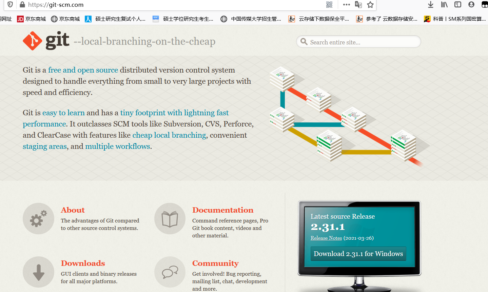

```shell
博主：
但是下载很慢，可以去找镜像！
官网下载太慢，我们可以使用淘宝镜像下载：http://npm.taobao.org/mirrors/git-for-windows/        

npm是什么？
NPM是随同NodeJS一起安装的包管理工具，能解决NodeJS代码部署上的很多问题，常见的使用场景有以下几种：
    允许用户从NPM服务器下载别人编写的第三方包到本地使用。
    允许用户从NPM服务器下载并安装别人编写的命令行程序到本地使用。
    允许用户将自己编写的包或命令行程序上传到NPM服务器供别人使用。
```

最后自己通过尝试发现浏览器下载确实很慢，但可以复制路径将其在迅雷上下载就会恢复正常的下载速度。


> ??? 再查一下为什么不能设置 或许是配置环境变量问题 
>
> 下周还需要学习一下vscode的配置和应用

在下载中选择默认编辑器时(不能设置vscode为默认进行下一步 原因？)： 空开    最后选择了vim 

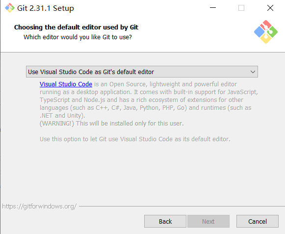

然后我在vscode中配置git，查到的方法两种  

方法一（https://www.pianshen.com/article/59191093651/）

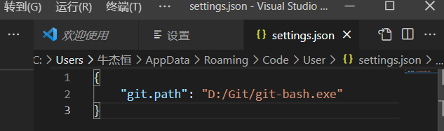

方法二（https://www.cnblogs.com/liangxuran/p/13715482.html）

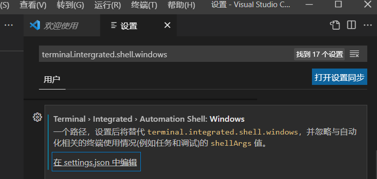

但是显示只有powershell

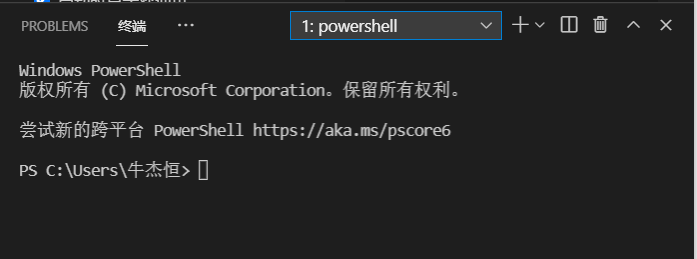


> 启动Git

安装成功后在开始菜单中会有Git项，菜单下有3个程序：任意文件夹下右键也可以看到对应的程序！

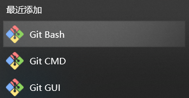

**Git Bash：**Unix与Linux风格的命令行，使用最多，推荐最多

**Git CMD：**Windows风格的命令行

**Git GUI**：图形界面的Git，不建议初学者使用，尽量先熟悉常用命令

> 基本的Linux命令学习

平时一定要多使用这些基础的命令！

1）、cd : 改变目录。

2）、cd . . 回退到上一个目录，直接cd进入默认目录

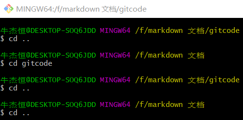

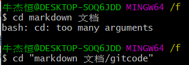

**路径名或者变量中间有空格时，可以用双引号括起来，不然会报错：bash: cd: too many arguments**

3）、pwd : 显示当前所在的目录路径。

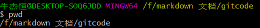

4）、ls(ll):  都是列出当前目录中的所有文件，只不过ll(两个ll)列出的内容更为详细。

5）、touch : 新建一个文件 如 touch index.js 就会在当前目录下新建一个index.js文件。

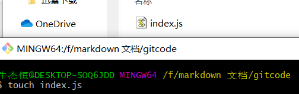

6）、rm:  删除一个文件, rm index.js 就会把index.js文件删除。

7）、mkdir:  新建一个目录,就是新建一个文件夹。

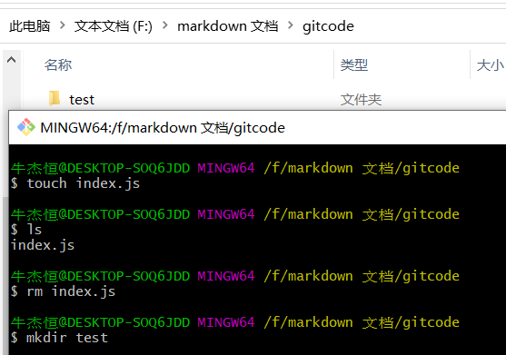

8）、rm -r :  删除一个文件夹, rm -r src 删除src目录

```
rm -rf /  切勿在Linux中尝试！删除电脑中全部文件！ 遍历删除“/”表示根
```

9）、mv 移动文件, mv index.html src (index.html 是我们要移动的文件, src 是目标文件夹,)当然, 这样写,必须保证文件和目标文件夹在同一目录下。

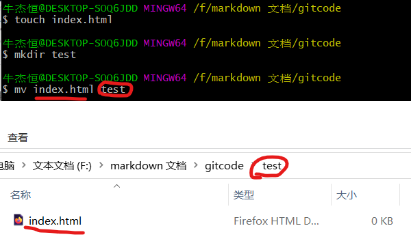

10）、reset 重新初始化终端/清屏。

11）、clear 清屏。      windows下时cls

12）、history 查看命令历史。

13）、help 帮助。

14）、exit 退出。

15）、#表示注释

> Git配置

所有的配置文件，其实都保存在本地！

```shell
#查看不同级别的配置文件：
#查看所有的配置
git config -l
#查看系统config
git config --system --list　　
#查看当前用户（global）配置
git config --global  --list
```

查看所有的配置 git config -l（包括自己后续的配置）

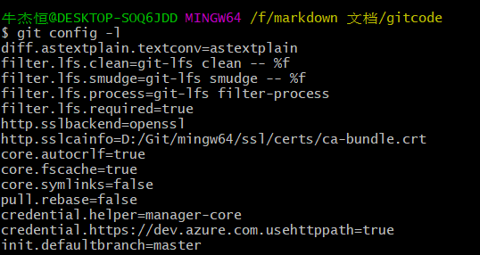

查看系统配置 git config --system --list  （显示的和上图一样是因为新的git没有进行用户配置，后续会配置用户名和邮箱）    Linux下所有的配置文件都在etc文件下！

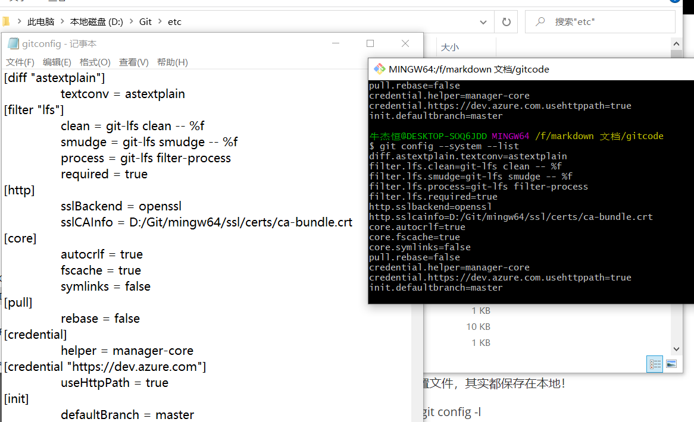

查看当前用户（global）配置 git config --global  --list    （未进行配置的显示）

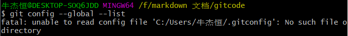

> 设置用户名与邮箱（用户表示 很重要！）

当你安装Git后首先要做的事情是设置你的用户名称和e-mail地址。这是非常重要的，因为每次Git提交都会使用该信息。它被永远的嵌入到了你的提交中：

```shell
1.git config --global user.name "....."  #名称
2.git config --global user.email ......@123.com   #邮箱
```

只需要做一次这个设置，如果你传递了--global 选项，因为Git将总是会使用该信息来处理你在系统中所做的一切操作。如果你希望在一个特定的项目中使用不同的名称或e-mail地址，你可以在该项目中运行该命令而不要--global选项。总之--global为全局配置，不加为某个项目的特定配置。


**Git相关的配置文件：**

1）、Git\etc\gitconfig  ：Git 安装目录下的 gitconfig   --system 系统级

2）、C:\Users\Administrator\ .gitconfig   只适用于当前登录用户的配置  --global 全局

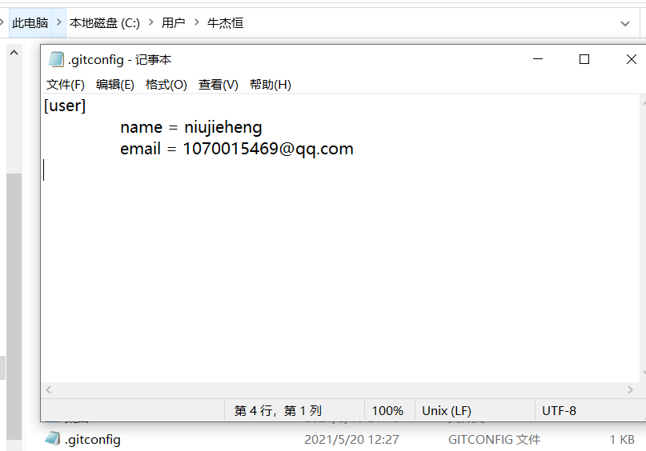


## Git基本理论(核心) ##

> 四个区域

Git本地有三个工作区域：工作目录（Working Directory）、暂存区(Stage/Index)、资源库(Repository或Git Directory)。如果在加上远程的git仓库(Remote Directory)就可以分为四个工作区域。文件在这四个区域之间的转换关系如下：

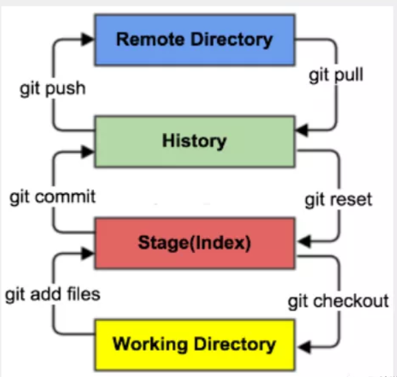

平时用的最多的就是Workspace和Remote。

- Workspace：工作区，就是你平时存放项目代码的地方
- Index / Stage：暂存区，用于临时存放你的改动，事实上它只是一个文件，保存即将提交到文件列表信息
- Repository：仓库区（或本地仓库），就是安全存放数据的位置，这里面有你提交到所有版本的数据。其中HEAD指向最新放入仓库的版本
- Remote：远程仓库，托管代码的服务器，可以简单的认为是你项目组中的一台电脑用于远程数据交换

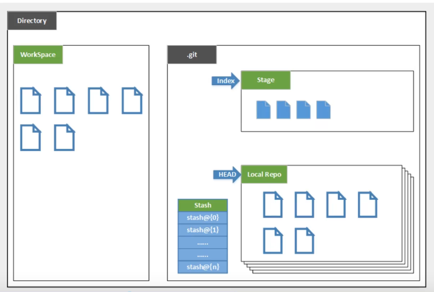

- Directory：使用Git管理的一个目录，也就是一个仓库，包含我们的工作空间和Git的管理空间。
- WorkSpace：需要通过Git进行版本控制的目录和文件，这些目录和文件组成了工作空间。
- .git：存放Git管理信息的目录，初始化仓库的时候自动创建。 ==(隐藏文件夹)==
- Index/Stage：暂存区，或者叫待提交更新区，在提交进入repo之前，我们可以把所有的更新放在暂存区。
- Local Repo：本地仓库，一个存放在本地的版本库；HEAD会只是当前的开发分支（branch）。
- Stash：隐藏，是一个工作状态保存栈，用于保存/恢复WorkSpace中的临时状态。

> 工作流程

git的工作流程一般是这样的：

１、在工作目录中添加、修改文件；

２、将需要进行版本管理的文件放入暂存区域； git add.  "."表示将所有文件add进去

３、将暂存区域的文件提交到git仓库。  git commit

因此，git管理的文件有三种状态：已修改（modified）,已暂存（staged）,已提交(committed)

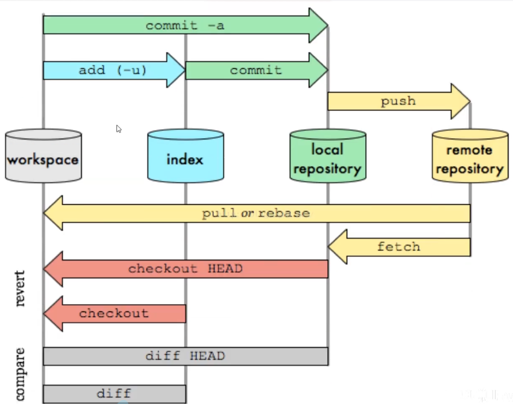


## Git项目搭建

> 创建工作目录与日常指令

工作目录（WorkSpace)一般就是你希望Git帮助你管理的文件夹，可以是你项目的目录，也可以是一个空目录，建议不要有中文。 

重点：add、commit、push

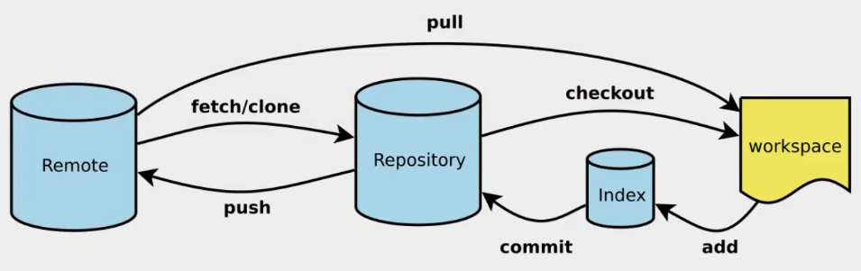

再写一次：平时用的最多的就是Workspace和Remote。

- Workspace：工作区，就是你平时存放项目代码的地方
- Index / Stage：暂存区，用于临时存放你的改动，事实上它只是一个文件，保存即将提交到文件列表信息
- Repository：仓库区（或本地仓库），就是安全存放数据的位置，这里面有你提交到所有版本的数据。其中HEAD指向最新放入仓库的版本
- Remote：远程仓库，托管代码的服务器，可以简单的认为是你项目组中的一台电脑用于远程数据交换

> 本地仓库搭建

创建本地仓库的方法有两种：一种是创建全新的仓库，另一种是克隆远程仓库。

1、创建全新的仓库，需要用GIT管理的项目的根目录执行：

```shell
# 在当前目录新建一个Git代码库也被称为初始化代码库
$ git init
```

2、执行后可以看到，仅仅在项目目录多出了一个.git目录，关于版本等的所有信息都在这个目录里面。（隐藏的文件）

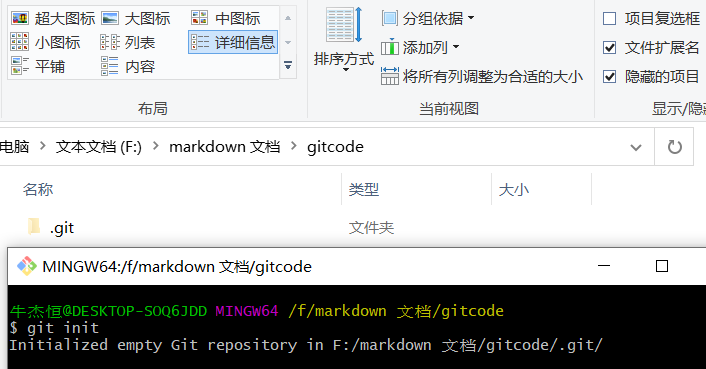

> 克隆远程仓库

随便找了一个gitee，克隆橙颜色的url

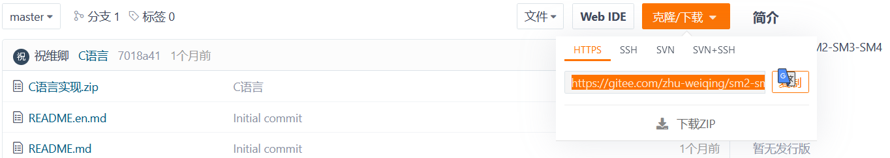

1、另一种方式是克隆远程目录，由于是将远程服务器上的仓库完全镜像一份至本地！

```bash
# 克隆一个项目和它的整个代码历史(版本信息)
$ git clone [url]     # https://gitee.com/kuangstudy/openclass.git
```

2、去 gitee 或者 github 上克隆一个测试！

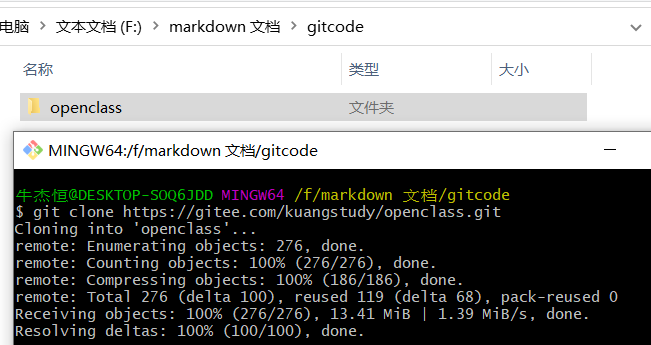


## Git文件操作 ##

> 文件的四种状态

版本控制就是对文件的版本控制，要对文件进行修改、提交等操作，首先要知道文件当前在什么状态，不然可能会提交了现在还不想提交的文件，或者要提交的文件没提交上。

- Untracked: 未跟踪, 此文件在文件夹中, 但并没有加入到git库, 不参与版本控制. 通过==git add==状态变为==Staged==.
- Unmodify: 文件已经入库, 未修改, 即版本库中的文件快照内容与文件夹中完全一致. 这种类型的文件有两种去处, 如果它被修改, 而变为==Modified==. 如果使用==git rm==移出版本库, 则成为==Untracked==文件
- Modified: 文件已修改, 仅仅是修改, 并没有进行其他的操作. 这个文件也有两个去处, 通过==git add==可进入暂存==staged==状态, 使用==git  checkout== 则丢弃修改过, 返回到==unmodify==状态, 这个==git checkout==即从库中取出文件, 覆盖当前修改 !
- Staged: 暂存状态. 执行==git commit==则将修改同步到库中, 这时库中的文件和本地文件又变为一致, 文件为==Unmodify==状态. 执行==git reset HEAD filename==取消暂存, 文件状态为==Modified==

> 查看文件状态

上面说文件有4种状态，通过如下命令可以查看到文件的状态：

```shell
#查看指定文件状态
git status [filename]

#查看所有文件状态
git status

# git add .                  添加所有文件到暂存区
# git commit -m "消息内容"    提交暂存区中的内容到本地仓库 -m 提交信息
```

```bash
工作中：（顺序如下）
1.将文件放在统一的工作目录下。
2.git add .                #添加到暂存区
3.git status [filename]    #查看是否添加到暂存区
4.git commit -m "消息内容"  #提交到本地
5.连到远程在push

跟着上面流程图和工作文字顺序过一遍：
 1. 首先在自己的代码目录(workspace)中创建文档hello.txt
 2. 牛杰恒@DESKTOP-SOQ6JDD MINGW64 /f/markdown 文档/gitcode (master)
    $ git add .

 3. 牛杰恒@DESKTOP-SOQ6JDD MINGW64 /f/markdown 文档/gitcode (master)
    $ git status 
    On branch master
    No commits yet
    Changes to be committed:
      (use "git rm --cached <file>..." to unstage)
           new file:   hello.txt

 4. 牛杰恒@DESKTOP-SOQ6JDD MINGW64 /f/markdown 文档/gitcode (master)
    $ git commit -m "new file hello.txt"
    [master (root-commit) 73bf8b5] new file hello.txt
     1 file changed, 0 insertions(+), 0 deletions(-)
     create mode 100644 hello.txt

 5. 牛杰恒@DESKTOP-SOQ6JDD MINGW64 /f/markdown 文档/gitcode (master)
    $ git status
    On branch master
    nothing to commit, working tree clean
```

> 忽略文件

视频博主是讲的一个springboot前端框架，上传的时候不用所有东西都上传。（此时忽略文件）

有些时候我们不想把某些文件纳入版本控制中，比如数据库文件，临时文件，设计文件等

在主目录下建立".gitignore"文件，此文件有如下规则：

1. 忽略文件中的空行或以井号（#）开始的行将会被忽略。
2. 可以使用Linux通配符。例如：星号（*）代表任意多个字符，问号（？）代表一个字符，方括号（[abc]）代表可选字符范围，大括号（{string1,string2,...}）代表可选的字符串等。
3. 如果名称的最前面有一个感叹号（!），表示例外规则，将不被忽略。
4. 如果名称的最前面是一个路径分隔符（/），表示要忽略的文件在此目录下，而子目录中的文件不忽略。
5. 如果名称的最后面是一个路径分隔符（/），表示要忽略的是此目录下该名称的子目录，而非文件（默认文件或目录都忽略）。

```bash
#为注释
*.txt        #忽略所有 .txt结尾的文件,这样的话上传就不会被选中！
!lib.txt     #但lib.txt除外
/temp        #仅忽略项目根目录下的TODO文件,不包括其它目录temp  "/"在前面向上忽略
build/       #忽略build/目录下的所有文件                    "/"在后面向下忽略
doc/*.txt    #会忽略 doc/notes.txt 但不包括 doc/server/arch.txt

博主展示IDEA中的配置(会自动生成 理解一下)

*.class
*.log
*.lock

# Package Files #
*.jar
*.war
*.ear
target/

# idea
.idea/
*.iml/

*velocity.log*

### STS ###
.apt_generated
.factorypath
.springBeans

### IntelliJ IDEA ###
*.iml
*.ipr
*.iws
.idea
.classpath
.project
.settings/
bin/

*.log
tem/

#rebel
*rebel.xml*
```


## 使用码云 ##

> GitHub是有墙的，一般比较慢，国内一般用gitee，公司中有时候会搭建自己的gitlab服务器

1、注册登录码云，完善个人信息

2、设置本机绑定SSH公钥，实现免密码登录！（免密码登录，这一步挺重要的，码云是远程仓库，我们是平时工作在本地仓库！)

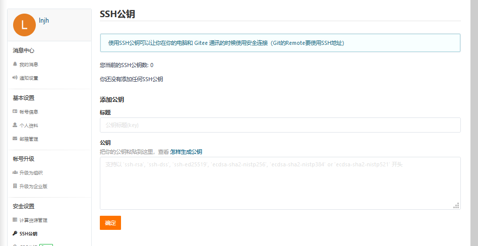

```bash
在自己进行视频操作的时候，发现本地没有.ssh文件
百度发现需要进行一个创建
在Git Bash中输入
$ ssh-keygen -t rsa -C "你的邮箱"
成功创建SSH key，查看~/.ssh，现在文件存在了
```

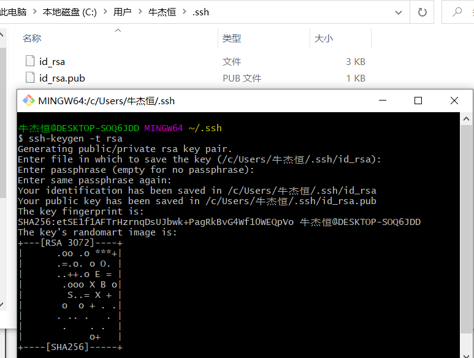

3、将公钥信息public key 添加到码云账户中即可！

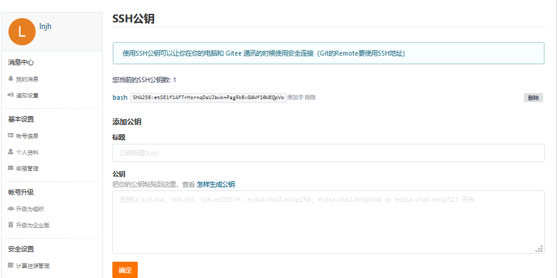

4、使用码云创建一个自己的仓库！

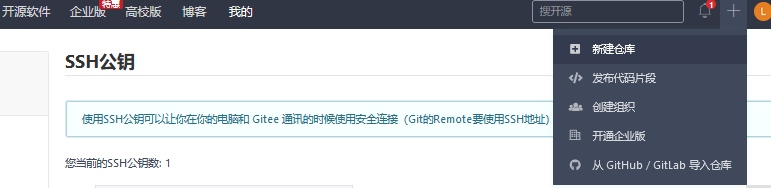

开源许可证：开源是否可以随意转载，开源但是不能商业使用，不能转载，...  限制作用

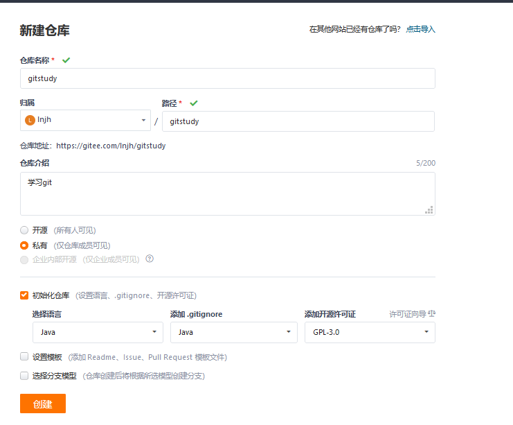

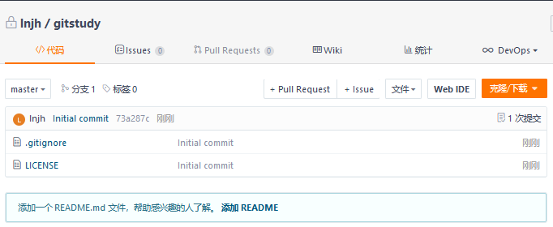

克隆到本地！（私有的仓库克隆需要密码，开源的仓库可以直接下载到本地）

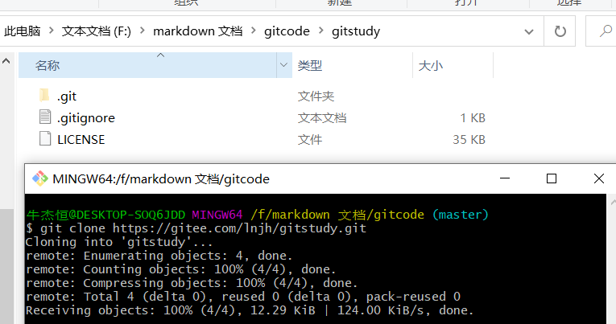

## Github中创建 ##

(还需要在做一遍，错的有点多)

1.注册github账号

2.创建项目（start a project）

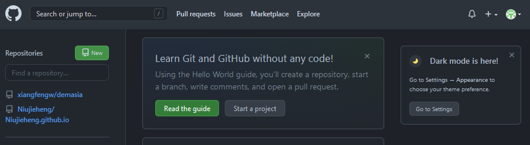

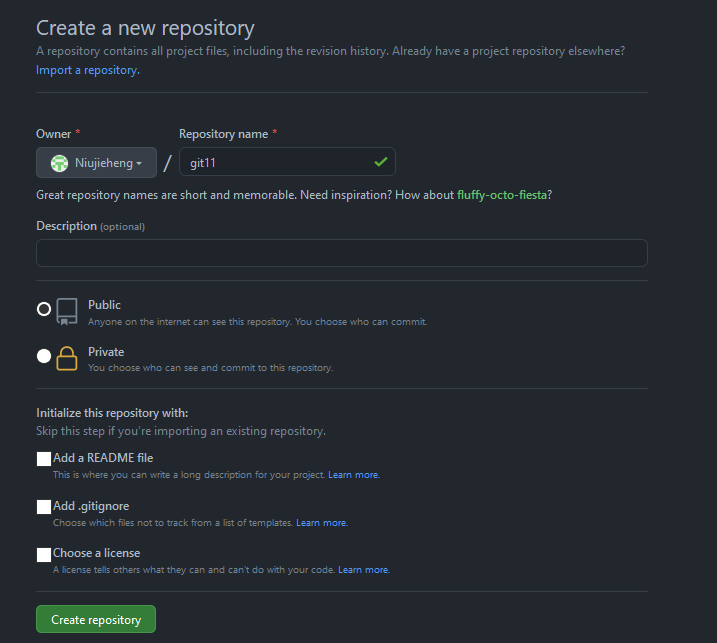

3.通过SSH设置（会显示创建新的仓库在命令行(其中origin代表是一个远地连接)还是在一个已有的仓库进行操作）

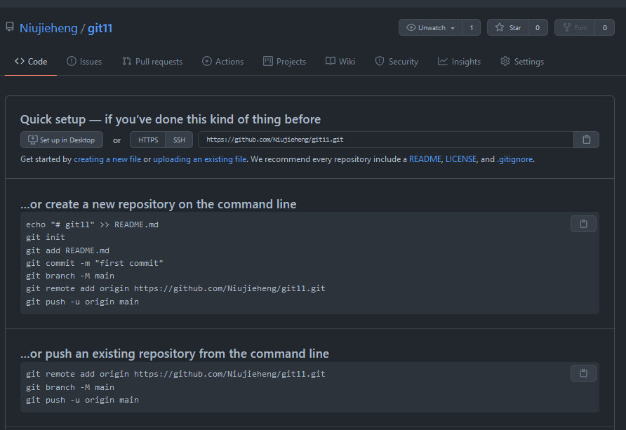

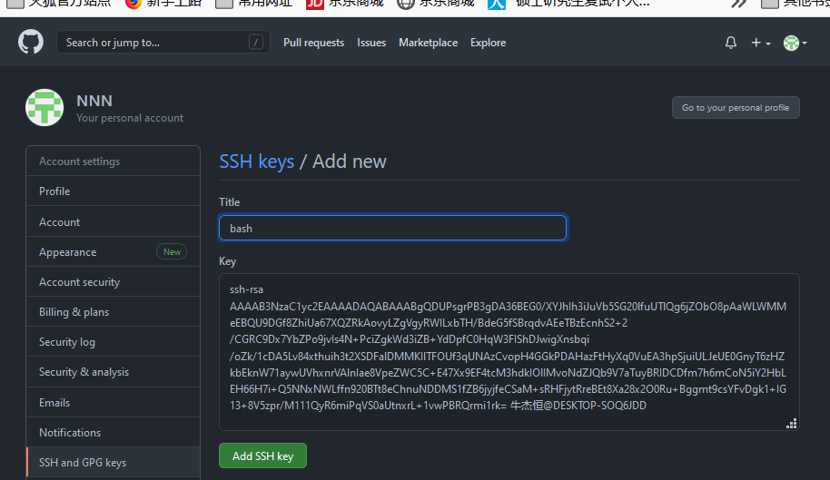

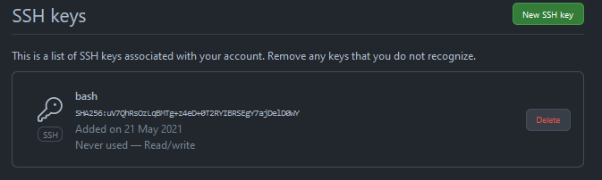

4.进行文件的上传（在码云上练习的是克隆到本地）

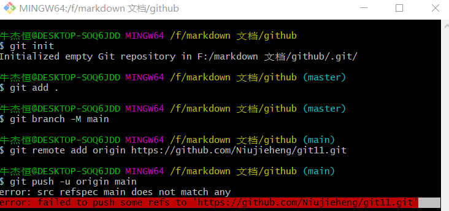

检查一下文件的位置 发现没有存入本地（按照网站提示为什么会错呢？ 需要再看一下）

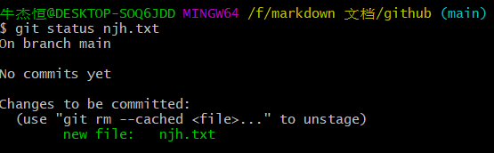

将文件提交到本地

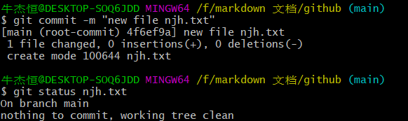

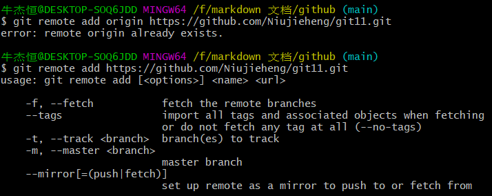

显示401 需要输入账号和密码 （那就是ssh错误了？ 用的是gitee生成的公钥可是在一个.ssh文件下）

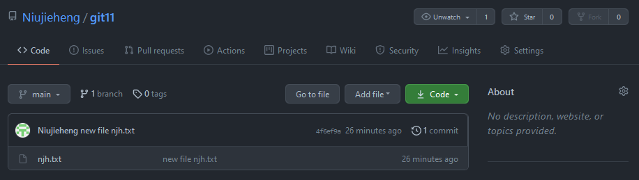


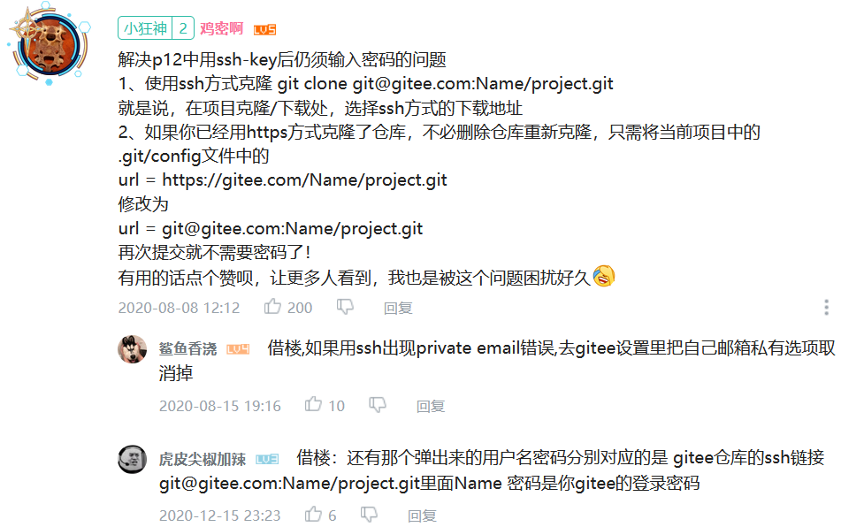


## IDEA中集成Git ##

博主是用IntelliJ IDEA（简称 IDEA），是一种 Java 语言开发的集成环境，来进行的演示（包括上传和下载），我们可以用vscode来尝试。

## GIT分支

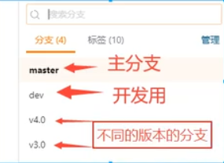

git分支中常用指令：

```bash
# 列出所有本地分支
git branch

# 列出所有远程分支
git branch -r

# 新建一个分支，但依然停留在当前分支
git branch [branch-name]

# 新建一个分支，并切换到该分支
git checkout -b [branch]

# 合并指定分支到当前分支
$ git merge [branch]

# 删除分支
$ git branch -d [branch-name]

# 删除远程分支
$ git push origin --delete [branch-name]
$ git branch -dr [remote/branch]
```

==如果同一个文件在合并分支时都被修改了则会引起冲突：解决的办法是我们可以修改冲突文件后重新提交！选择要保留他的代码还是你的代码!==

master主分支应该非常稳定，用来发布新版本，一般情况下不允许在上面工作，工作一般情况下在新建的dev分支上工作，工作完后，比如上要发布，或者说dev分支代码稳定后可以合并到主分支master上来。

Git学习：https://gitee.com/all-about-git、https://oschina.gitee.io/learn-git-branching/

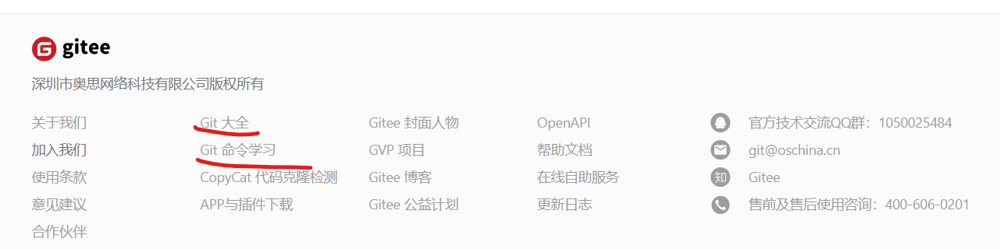


参考视频博主学习笔记：https://mp.weixin.qq.com/s/Bf7uVhGiu47uOELjmC5uXQ

