# 2021.5.28 周报

## 本周完成工作

1.git基础学习完

2.论文通过学校检查

3.提交答辩PPT

4.按照老师要求做好每月计划

## 本周相关总结

临近毕业，心思有点飘，学习效率降低，完成的任务较少。

## 下周工作计划

1.给老师演示答辩流程

2.通过学校答辩

3.继续相关新手村通告的学习


# codeup任务内容

## 远程仓库克隆

将codeup平台中托管的远程仓库WeeklyReports克隆到本地操作如下：

1、将设置自己的SSH公钥，方便后续直接克隆到本地的操作。

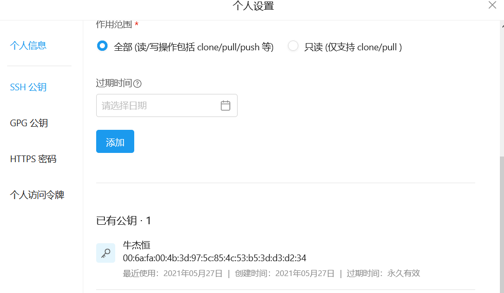

2、创建一个文件夹并初始化代码库

3、将远程仓库克隆到本地

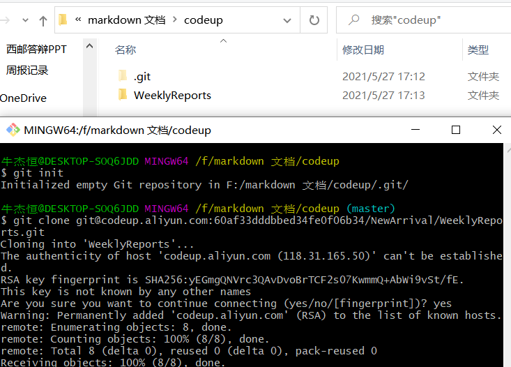

## 创建本地分支

以下实验在gitee中实现

> 方法一 ：先在本地创建，再将分支推送到远程

```bash
1. $ git branch newbranch       #在本地新建分支
2. $ git push origin newbranch  #把本地分支push到远程
3. $ git checkout newbranch     #切换到该分支
```

1、新建本地分支 命名lnjh

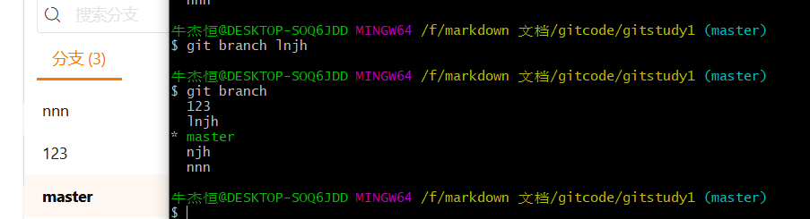

2、将本地分支push到远程

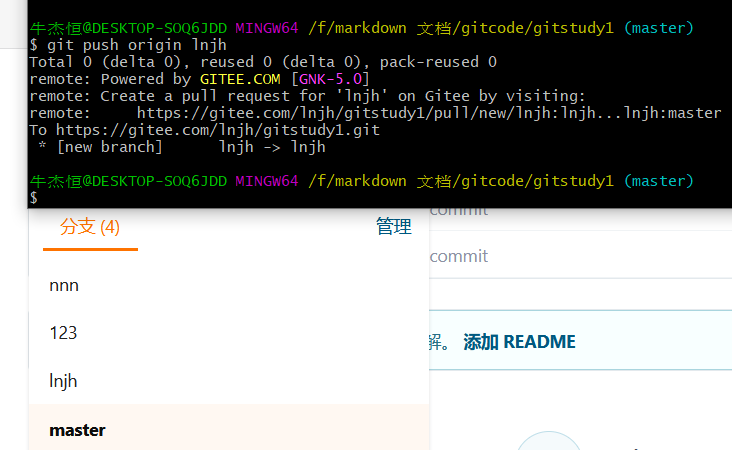

3、切换到lnjh分支

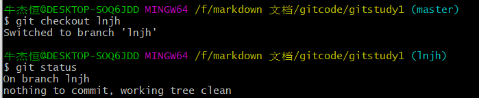

4、切回主分支

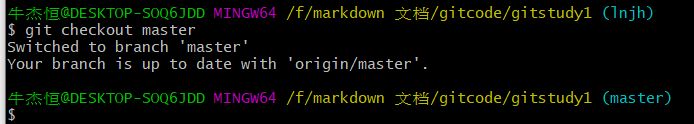

> 方法二：先在远程仓库中手动创建，再将分支拉去下来

```bash
1.$ git branch                #查看一下本地分支，
2.$ git branch -a             #查看一下远程分支，对比下，远程存在哪些本地没有的新分支.
3.$ git fetch                 #将某个远程主机的更新，全部取回本地
4.$ git branch -a             #再次查看远程分支(远程的分支已经可以看见了)
5.$ git checkout -b 远程分支名  #拉取远程分支到本地
```

1、点击管理

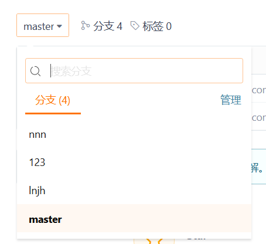

2、进入后创建分支并命名


3、查看本地分支和远程分支

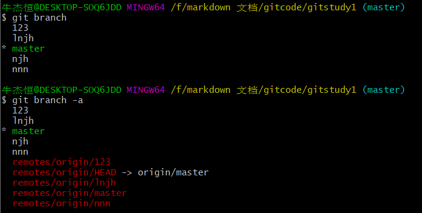

4、将远程更新并再次查看远程分支

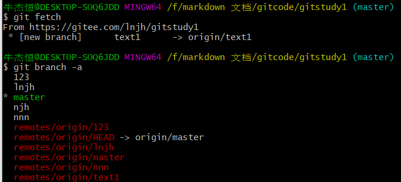

5、拉去远程分支并进行切换

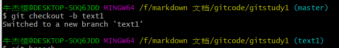

## 推送文件

```bash
1.在已创建初始化的仓库中放入你想提交的文件。
2. $ git add .             #添加到暂存区
3. $ git commit -m "name"  #查看是否添加到暂存区
4. $ git status name       #提交到本地
5. $ git push origin name  #推送到远程仓库 这个“name”指推送的仓库名字
```

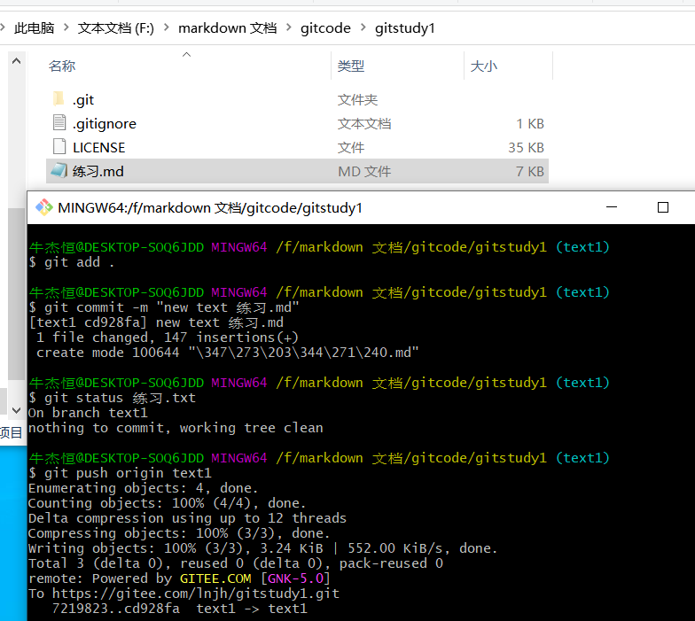

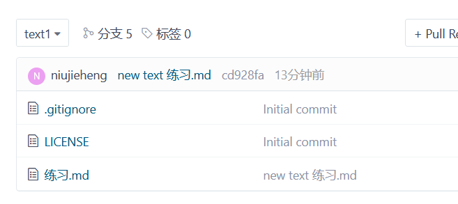

