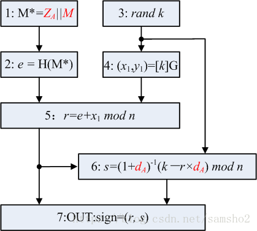

# 2021.5.7 周报

## 本周完成工作

1.linux下docker的安装

2.学习markdown语言的基本命令

3.代码找毕设老师检查

## 本周工作总结

1.还需尽快完成论文的编写

2.代码经检查还需增加一些细小的功能 如对文件进行加解密并对学生信息填写进行可视化界面的编写

3.下载了Typora进行markdown语言的学习

## 下周工作计划

1.完成论文的编写并降低查重率。

2.完善程序代码

3.继续学习docker用markdown语言存档


# Markdown学习

## 标题（#需空格）

### 三级标题

#### 四级标题


## 字体

**hello,world! 粗体 加两个星号（不加空格） **

*hello,world!斜体 加一个星号（不加空格）*

***hello,world! 斜体加粗 三个星号（不加空格）***

~~hello,world! 划线 两个波浪号（~）~~

## 引用

> 学习markdown 大于号空格（> ）

## 分割线

三个‘-’

---

三个’*‘

***

## 图片



语法 英文！[写图片名字] ()

## 超链接

[点击跳转到百度]+(地址)

[点击跳转到百度](https://www.baidu.com/index.php?tn=monline_3_dg)

eg.参考博客时使用或引用图片

## 列表

有序列表1. 空格回车 # 1. 

1. a
2. b
3. c

无序列表’-‘空格回车 #- 

- a
- b

## 表格

可右键插入直接插入表格

| 名字 | 性别 | 生日 |
| ---- | ---- | ---- |
|      |      |      |

语法#   |--|--|--| 

## 代码

三个点#```   1左边的按键英文

```python
print()
```


