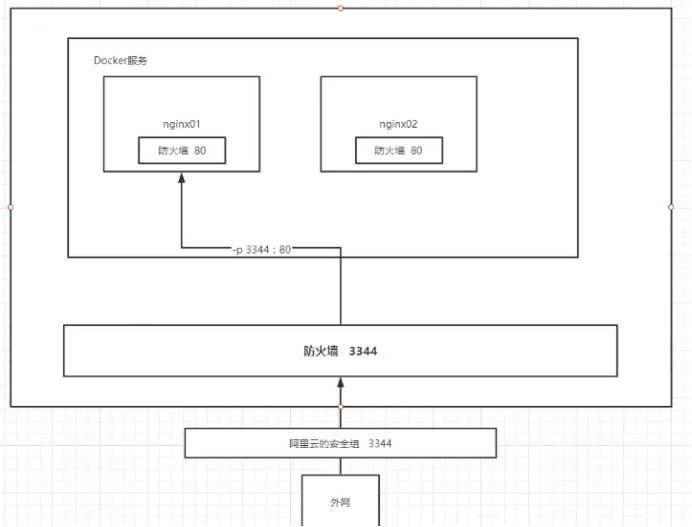
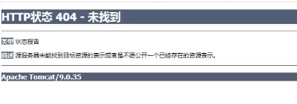
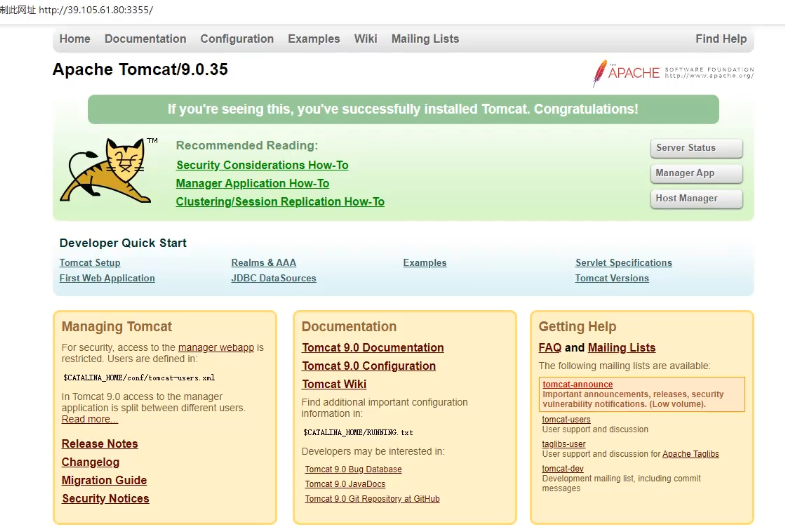
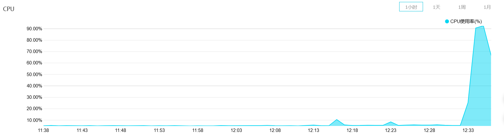
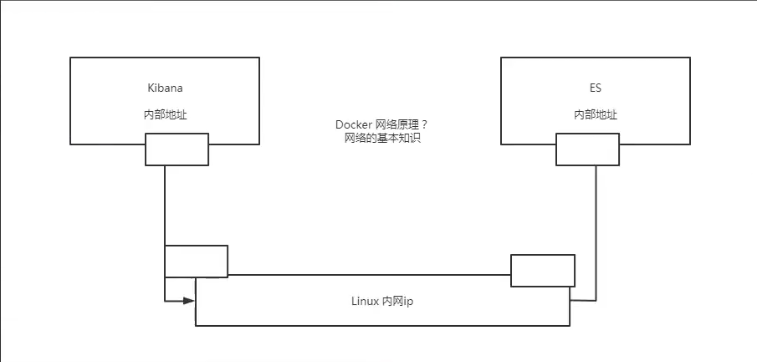

# 练习

> 普及常识

Nginx是一款高性能的http 服务器/反向代理服务器及电子邮件（IMAP/POP3）代理服务器。能够支支撑5万并发链接，并且cpu、内存等资源消耗却非常低，运行非常稳定。

tomcat所做的事情主要有：开启监听端口监听用户的请求，解析用户发来的http请求然后访问到你指定的应用系统，然后你返回的页面经过tomcat返回给用户。

Apache,Nginx和Tomcat的区别：

Apache全称是 Apache Http Server Project, Tomcat全称是 Apache Tomcat。

Apache和 Nginx用于处理静态资源， tomcat用来处理动态资源。

Apache和Nginx相比，Nginx适合做前端服务器，适合做负载均衡。

一般情况下，使用的时候，都是 Apache+Tomcat一起使用或者 Nginx+tomcat一起使用。

Docker 端口暴露的概念流程图 



==做实验把相应的端口打开==

> Docker安装Nginx

```shell
# 1.搜索镜像 search 去docker搜索，含有帮助文档。
# 2.下载镜像 pull
# 3.运行测试
[root@iZ2ze7labj6qanwunxqlweZ ~]# docker images
REPOSITORY   TAG       IMAGE ID       CREATED        SIZE
nginx        latest    f0b8a9a54136   4 days ago     133MB
centos       latest    300e315adb2f   5 months ago   209MB
#启动nginx 后台运行  -d 
#设置容器名字        --name  
#nginx默认端口号80 通过公网的3344可以访问docker的80端口 -p 3344:80 
#-p 宿主机端口:容器内部端口
[root@iZ2ze7labj6qanwunxqlweZ ~]# docker run -d --name nginx01 -p 3344:80 nginx
dc06268f3d5f798d3536ccd7af328e50fb7470b4542d93ca46b6c955c3155987
[root@iZ2ze7labj6qanwunxqlweZ ~]# docker ps
CONTAINER ID   IMAGE     COMMAND                  CREATED         STATUS         PORTS                                   NAMES
dc06268f3d5f   nginx     "/docker-entrypoint.…"   8 seconds ago   Up 7 seconds   0.0.0.0:3344->80/tcp, :::3344->80/tcp   nginx01
[root@iZ2ze7labj6qanwunxqlweZ ~]# curl localhost:3344
<!DOCTYPE html>
<html>
<head>
<title>Welcome to nginx!</title>
<style>
    body {
        width: 35em;
        margin: 0 auto;
        font-family: Tahoma, Verdana, Arial, sans-serif;
    }
</style>
</head>
<body>
<h1>Welcome to nginx!</h1>
<p>If you see this page, the nginx web server is successfully installed and
working. Further configuration is required.</p>

<p>For online documentation and support please refer to
<a href="http://nginx.org/">nginx.org</a>.<br/>
Commercial support is available at
<a href="http://nginx.com/">nginx.com</a>.</p>

<p><em>Thank you for using nginx.</em></p>
</body>
</html>

[root@iZ2ze7labj6qanwunxqlweZ ~]# docker exec -it nginx01 /bin/bash
root@dc06268f3d5f:/# where is nginx
bash: where: command not found
root@dc06268f3d5f:/# whereis nginx
nginx: /usr/sbin/nginx /usr/lib/nginx /etc/nginx /usr/share/nginx
root@dc06268f3d5f:/# cd /etc/nginx
root@dc06268f3d5f:/etc/nginx# ls
conf.d	fastcgi_params	koi-utf  koi-win  mime.types  modules  nginx.conf  scgi_params	uwsgi_params  win-utf
```

思考问题：每次改动nginx配置文件，都需要进入容器内部？十分麻烦，如果可以在容器外部提供一个映射路径，达到在容器修改文件名，容器内部就可以自动修改 -v 数据卷

> Docker安装tomcat

```shell
#官方使用
docker run -it --rm tomcat:9.0  一般用来测试，用完就删除
[root@iZ2ze7labj6qanwunxqlweZ ~]# docker ps -a
CONTAINER ID   IMAGE     COMMAND                  CREATED          STATUS                      PORTS     NAMES
dc06268f3d5f   nginx     "/docker-entrypoint.…"   45 minutes ago   Exited (0) 12 minutes ago             nginx01
454cdd53a047   centos    "/bin/bash"              2 days ago       Exited (0) 2 days ago                 flamboyant_ritchie

#之前的启动都是后台，停止了容器之后，容器还可以查到

#下载在启动
docker pull tomcat:10.0 #10.0是指定版本号 也可以不写

-d后台启动 -p [端口] 暴露端口启动
[root@iZ2ze7labj6qanwunxqlweZ ~]# docker run -d -p 3355:8080 --name tomcat01 tomcat
226542ecfcfd1bca1d3e73b39ff67f67e9a067ee60d7aa92588ead33a9082578

#进入容器
[root@iZ2ze7labj6qanwunxqlweZ ~]# docker exec -it tomcat01 /bin/bash
#发现问题：1.Linux命令少了。2.没有webapps(阿里云镜像独有特点。默认是最小的镜像，所有不必要的都剔除掉)
#保证最小课运行的环境！
root@226542ecfcfd:/usr/local/tomcat# cd webapps
root@226542ecfcfd:/usr/local/tomcat/webapps# ls
#解决过程：
root@226542ecfcfd:/usr/local/tomcat/webapps# cd ..
root@226542ecfcfd:/usr/local/tomcat# ls
BUILDING.txt	 LICENSE  README.md	 RUNNING.txt  conf  logs	    temp     webapps.dist
CONTRIBUTING.md  NOTICE   RELEASE-NOTES  bin	      lib   native-jni-lib  webapps  work
root@226542ecfcfd:/usr/local/tomcat# cd webapps.dist/
root@226542ecfcfd:/usr/local/tomcat/webapps.dist# ls
ROOT  docs  examples  host-manager  manager
root@226542ecfcfd:/usr/local/tomcat/webapps.dist# cd ..
root@226542ecfcfd:/usr/local/tomcat# cp -r webapps.dist/* webapps
```





> 部署es+kibana

``` shell
# es 暴露的端口很多
# es 十分消耗内存
# es 的数据一般需要放置
# --net somenetwork 网络配置

docker run -d --name elasticsearch --net somenetwork -p 9200:9200 -p 9300:9300 -e "discovery.type=single-node" elasticsearch:7.6.2

docker run -d --name elasticsearch -p 9200:9200 -p 9300:9300 -e "discovery.type=single-node" elasticsearch:7.6.2

#启动了Linux就很卡  docker stats 查看cpu状态
```



```shell
# 增加内存限制，修改配置文件 -e 环境配置修改
docker run -d --name elasticsearch02 -p 9200:9200 -p 9300:9300 -e "discovery.type=single-node" -e ES_JAVA_OPTS="Xms64m -Xmxs512m" elasticsearch:7.6.2
```



